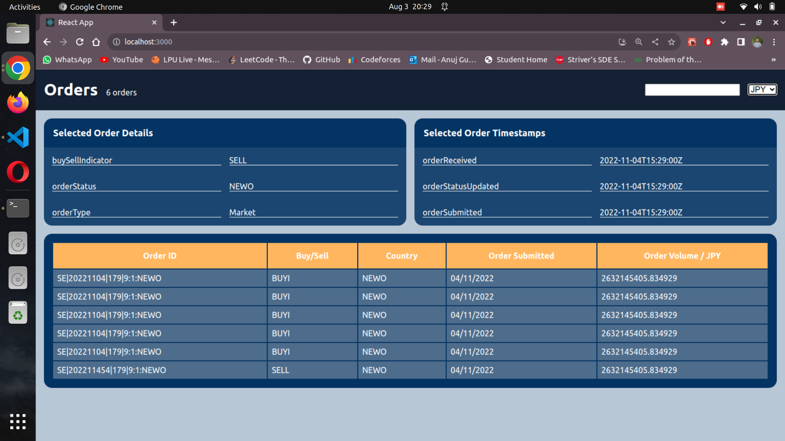

# Instructions

- clone this repo and open with your favorite code editor

- make sure you are checked out to `master` branch

- to run the app `npm install` then `npm start`

## I have resolved follwing issues :-

1. "In the title of the header, it displays `5 orders` but there are `6 orders` in the table. We want to display the `total` number of `orders` in the header title"  #Solved✅

2.  In the table order submitted date is missing, we have timestamp data included in the `src\assets\timeStamps.json` with the corresponding ids, please combine that with the order data and make sure the order submitted date is being displayed in the table. #Solved✅

3.  Order Volume cell is displaying USD values, can you please make it display the currency value selected on the dropdown located in the header of the dashboard. #Solved✅

5.  Can you please add search feature on the order IDs with the search bar given in the header #Solved✅

6.  Please clear the console errors and warnings. #Solved✅

7.  When user selects an order, can you populate the Card on top of the listing component as shown in the image #Solved✅

